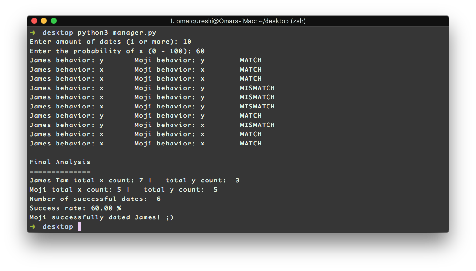

# objectInteractions

Two objects, amicably named after my TA and prof, exhibit a behavior. User is first prompted for the number of interactions. Then, the user picks the behavior probability of the first object, James (eg 60% produce x). The second object, Moji, then tries to match its behavior with James's intelligiently. 

Sample output:

